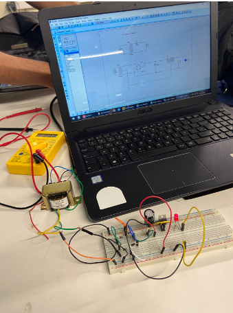
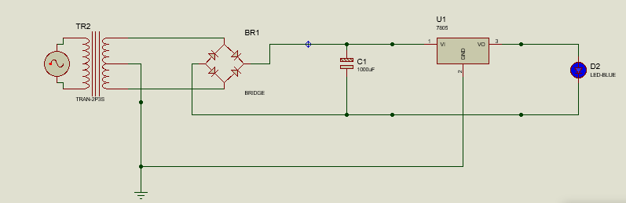
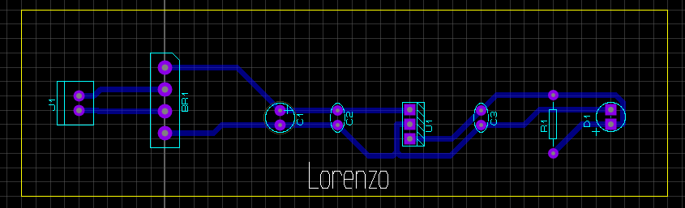
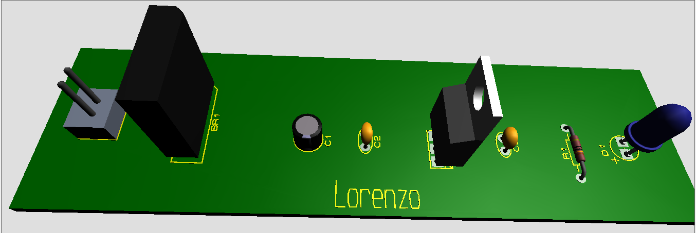

# Sistemas-Embarcados

<h5> Nome: Lorenzo Battistoni
<h3> <a> Funcionamento do Retificador: </a>
 
  
 Um retificador é um componente eletrônico que converte corrente alternada (CA) em corrente contínua (CC), realizando a supressão de uma das polaridades da forma de onda alternada, conforme a sua configuração, a fim de gerar uma saída de corrente contínua.

 <a> Simulação: </a>

 <a> Prototipagem: </a>

 <a> PCB: </a>

 <a> 3D: </a>

